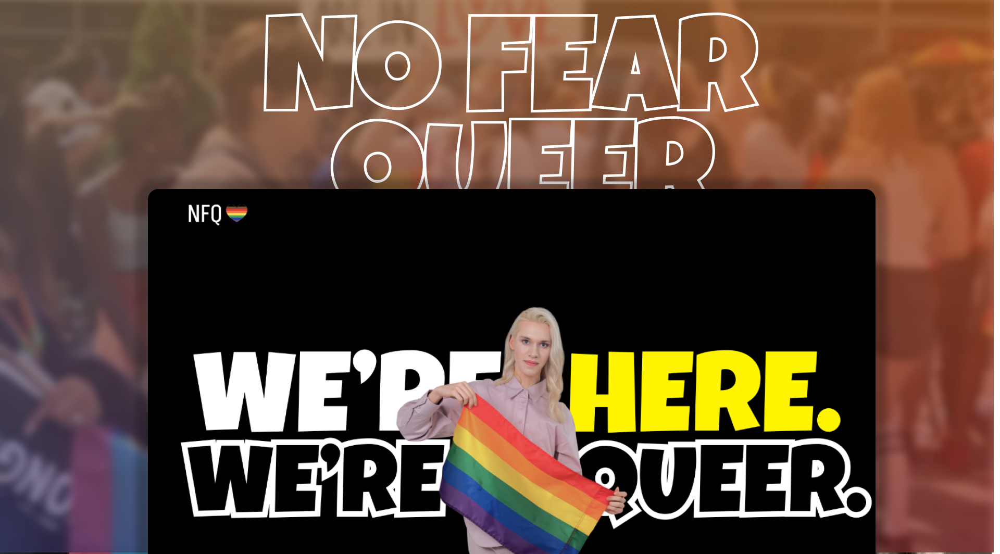

<h1 align="center">NFQ</h1>

## Tech Stack

- NextJs - *Typescript*
- Google Maps API
- NodeJs and ExpressJs
- MongoDB

## Inspiration

1. We believe this hackathon is a great opportunity for our career-boost. It also is a great learning point to pitch new ideas, learn, improve our present skills and find the right approach to make this project successful.
2. Dating is a struggle when it comes to LGBTQ community. We thought of developing an app which geologically locates everyone interested, creates personalized choices.
3. To attract the people, building a good UI is also necessary. We have focused on this aspect and have implemented a professional and simple UI.

## What it does

NFQ is an app for like-minded people who wish to explore their relationship desires in a safe place. One can create a profile which later helps in personalized recommendations. There is also an option of chatting and finding out whom you would like to catch up with, along with a news section to stay upadated.

## How we built it

We started off by planning and customizing the UI design and what major things to include. Then we proceeded to build the backend, deal with database then finalized. To make this project, we used many tech stacks and APIs. Some of them include - Typescript, Google Maps API, NodeJS, ExpressJS, MongoDB, Mongoose, Auth0.

## Challenges we ran into

We faced issues while dealing with Google Maps API and ABYL chat SDK. It was challenging for us to properly deploy the application but later we could figure it out.

## Accomplishments that we're proud of

This was the first time we used NextJS and Typescript. We could successfully implement the new features we learnt for this hackathon and could test out some others successfully. 

## What we learned

We learned about some APIs. Most importantly, this hackathon taught us how to work and contribute together and accomplish more together, some troubleshooting methodologies and engaging with different tech stacks.

## What's next for No Fear Queer

We are planning to fix the map and implement AI for recommendations. 

#### Contributor

- [Suvangi Paul](https://github.com/suvangipaul)
- [Barat Nikhita](https://github.com/nikhitaBarat/)
- [Siddhant Prateek](https://github.com/siddhantprateek)
